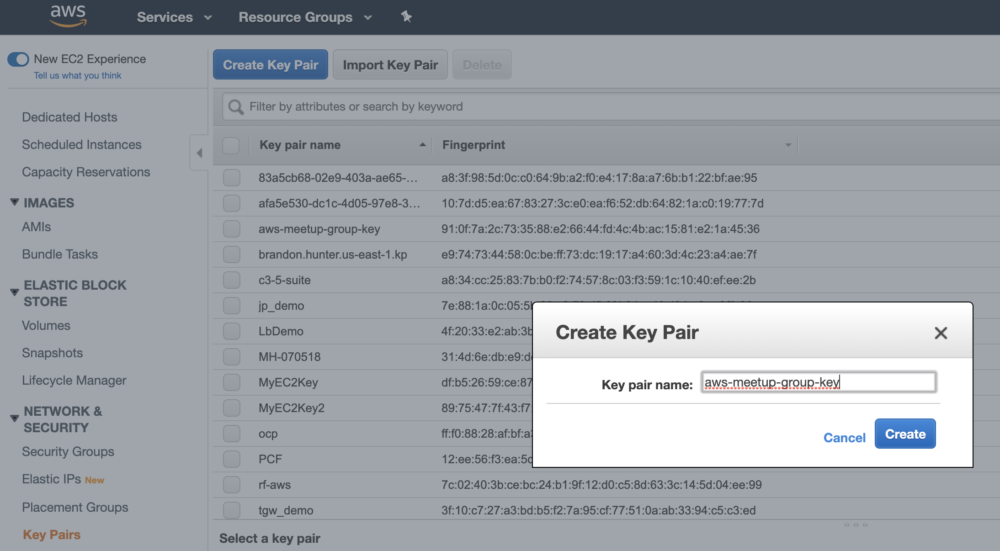
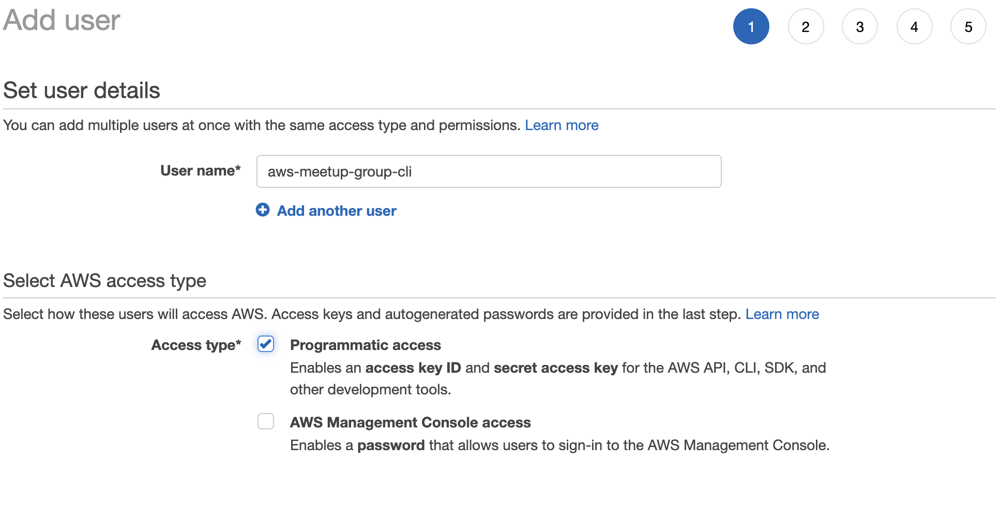
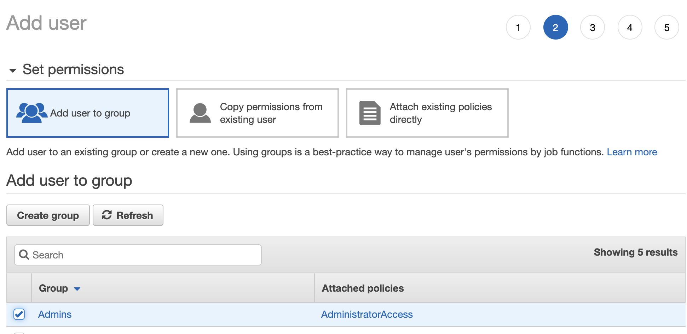
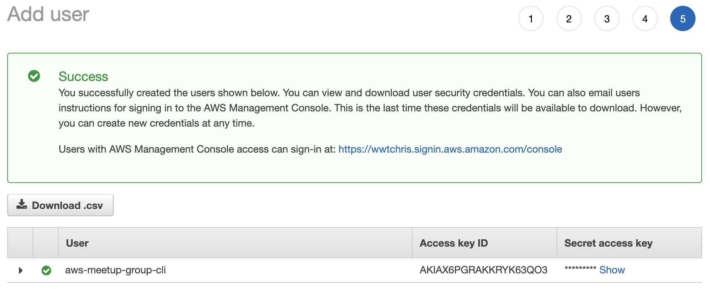
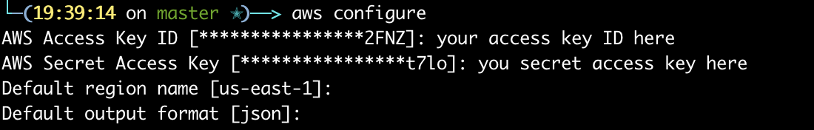
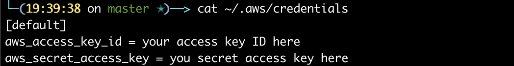

# aws-meetup-group-terraform-and-pulumi
Configiration files for Terraform Meetup as well as Pulumi typescript stack converted from TF files

## Getting started
 * Create an EC2 Key Pair in AWS console
 * Download and set privs on ssh pem file
 * Install Terraform and create first deployment
 * Create AWS CLI Account
 * Deploy IaaS Hosting Stack with EC2 and RDS
 * Install Pulumi and deploy IaaS hosting stack

### Create Key Pair:


### Download and set privs on ssh pem file:
* `mv ~/Downloads/aws-meetup-group-key.pem ~/.ssh/`
* `chmod 400 ~/.ssh/aws-meetup-group-key.pem`

### Create AWS CLI Account
IAM > Users > New User
* Name user
    - 
* Add to group or role with admin privs
    - 
* Configure access credenitals
    - 

### Install AWS CLI
* Mac: 
    - Homebrew: `brew install awscli `
    - Bundled installer:
        `curl "https://s3.amazonaws.com/aws-cli/awscli-bundle.zip" -o "awscli-bundle.zip"`
        `unzip awscli-bundle.zip`
        `sudo ./awscli-bundle/install -i /usr/local/aws -b /usr/local/bin/aws`
* Windows:
    - [Windows: MSI Installer](https://docs.aws.amazon.com/cli/latest/userguide/install-windows.html#install-msi-on-windows)

### Configure AWS CLI Access Locally
* `aws configure`
    - 
* Configure by viewing contents of `~/.aws/credentials` or `%UserProfile%\.aws\credentials`
    - 

### Install Terraform
* Homebrew (Mac): `brew install terraform`
* Chocolatey (Windows): `choco install terraform`
* Manual download: [Terraform.IO](https://www.terraform.io/downloads.html)

### TF Hello World file
```
provider "aws" {
  version = "~> 2.0"
  region  = "us-east-1"
}
resource "aws_vpc" "main" {
  cidr_block = "192.168.225.0/24"
  enable_dns_support = true
  enable_dns_hostnames = true
  tags = {
    CostCenter = "tf-helloworld"
  }
}
resource "aws_subnet" "main-subnet" {
  vpc_id     = "${aws_vpc.main.id}"
  cidr_block = "192.168.225.0/25"
  availability_zone = "us-east-1a"
  tags = {
    CostCenter = "tf-helloworld"
  }
}
```


### Plan, Apply, Show, And Destroy
* `terraform plan`
* `terraform apply`
* `terraform show`
* `terraform destroy`

### Create Pulumi Account and create Access Key
* [Get Pulumi Access Token](https://app.pulumi.com/account/tokens)

### Install Pulumi and Install AWS plugin
* Mac: `brew install pulumi`
* Windows
    - `choco install pulumi`
    - `@"%SystemRoot%\System32\WindowsPowerShell\v1.0\powershell.exe" -NoProfile -InputFormat None -ExecutionPolicy Bypass -Command "[Net.ServicePointManager]::SecurityProtocol = [Net.SecurityProtocolType]::Tls12; iex ((New-Object System.Net.WebClient).DownloadString('https://get.pulumi.com/install.ps1'))" && SET "PATH=%PATH%;%USERPROFILE%\.pulumi\bin"`
* `pulumi plugin install resource aws 1.18.0`

### Initialize Pulumi Stack and Deploy
* `cd pulumi-iaas-hosting-stack`
* `pulumi stack init`
    - You will need to enter access token created earlier in Pulumi portal
* Install Pulumi `npm install @pulumi/aws`
* `pulumi up`

### Destroy Resrouces and Delete Stack
* `pulumi destroy`
* `pulumi stack rm <account>/<stack>/<env> --force`


